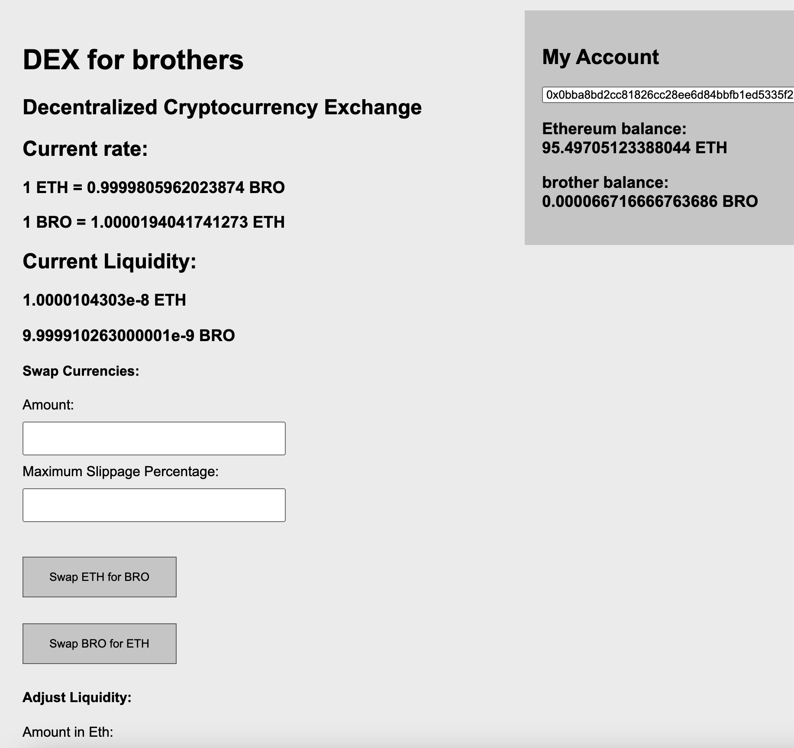
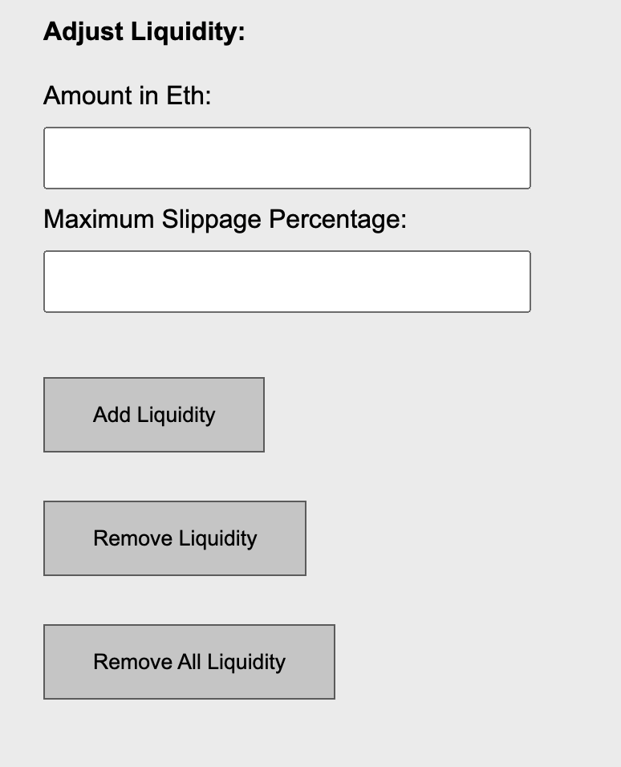

# Decentralized Cryptocurrency Exchange
A simplified version of Uniswap v1, allow you to swap ERC20 tokens, provide liquidity, and earn rewards.

## Key features
1. Swap Brother token with Eth
2. Participate in the pool by adding liquidity
3. Withdraw liquidity any time
4. Earn rewards from swap fee
5. Handle slippage by specifying max/min allowance when you swap
6. A full Dapp is setup to interact with contracts

## Design 
### Exchange rate unchanged when providing liquidity
Adding or removing liquidity does not change the exchange rate, since we always add / remove equal pair.

### LP token mint / burn algorithm

Each time a user adding liquidity, contract mint LP token for the user.
When user want to withdraw from pool, we burn the LP token.

### How to get reward
A 3% swap fee will be distributed proportionally based on providers’ fractional share of the liquidity pool at the
time that the swap took place.

All fees should be automatically reinvested into the pool on behalf of each liquidity provider.

However, this fee reinvestment does not have to happen during every single swap function, but it should happen shortly after it becomes possible to do so without violating x ∗ y = k.

### How to calculate pricing

Above is how uniswap v1 calculates pricing.

In our DEX, we apply a simpler formula:

The price of currency B in terms of currency A can the be calculated as x/y, whereas the price of currency A in terms of currency B can be calculated as y/x.

